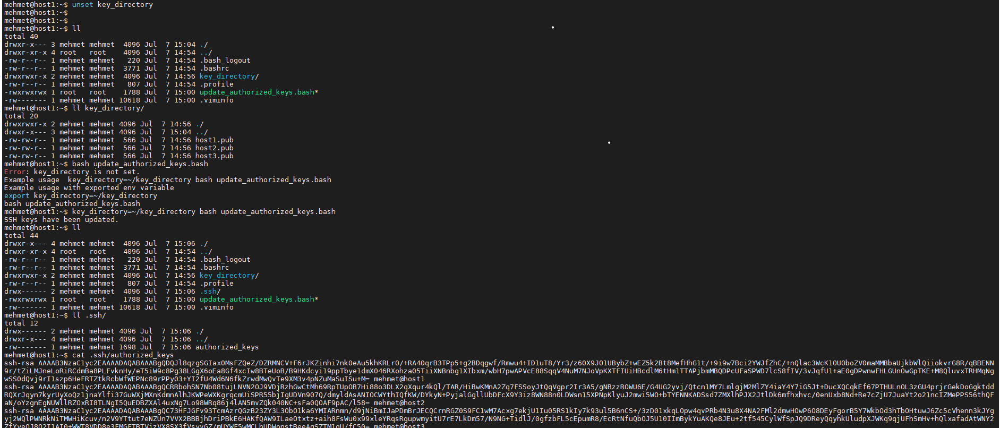
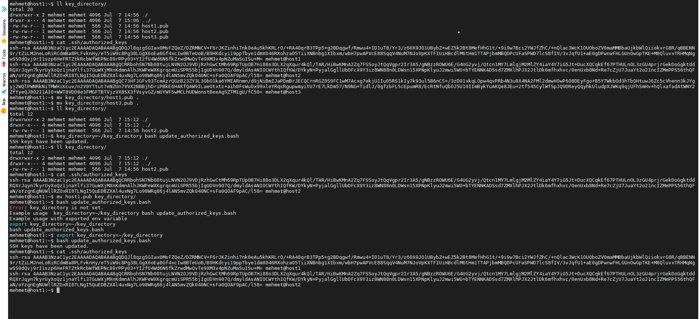

# Example usage:
# how to get only script

```
wget https://raw.githubusercontent.com/nto4/update_authorized_ssh_pub_keys/main/update_authorized_keys.bash
chmod +x update_authorized_keys.bash
```


# how to preparede  your key_directory in that format
```
key_directory/
├── host1.pub
├── host2.pub
└── host3.pub
```

# how to run
```
key_directory=~/key_directory bash update_authorized_keys.bash 
```
or set gloval venv
```
export key_directory=~/key_directory
bash update_authorized_keys.bash 
```

### usage and result samples 




